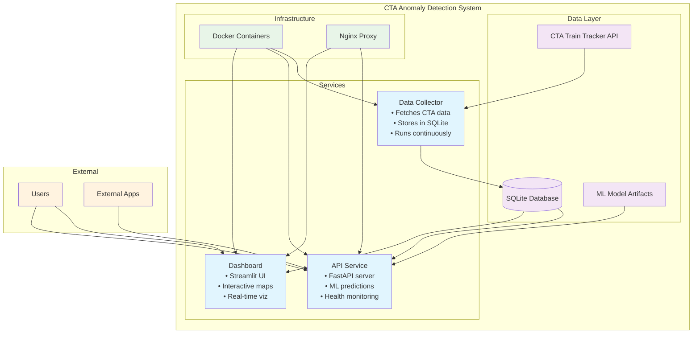

# CTA Anomaly Detection System

A real-time anomaly detection system for the Chicago Transit Authority (CTA) train network that monitors live train data, detects unusual patterns using machine learning, and provides an interactive dashboard for visualization.

## What It Does

This system continuously monitors CTA train positions and identifies anomalies in real-time, such as:
- Trains moving unusually slow or fast
- Unexpected stops between stations
- Route deviations
- System-wide disruptions

The system provides both an API for programmatic access and a web dashboard for visual monitoring.

## Quick Start

### Prerequisites
- Docker and Docker Compose installed
- Internet connection for CTA API access

### One-Command Setup
```bash
./scripts/docker-start.sh
```

This will:
- Build all Docker containers
- Start the API, dashboard, and data collector services
- Begin collecting live CTA data

### Access the System
- **Dashboard**: http://localhost:8501 - Interactive map and visualizations
- **API**: http://localhost:8000 - REST API for predictions
- **API Docs**: http://localhost:8000/docs - Interactive API documentation

### Stop the System
```bash
./scripts/docker-stop.sh
```

## Features

### Real-Time Monitoring
- Continuous data collection from CTA Train Tracker API
- Live anomaly detection with confidence scores
- Historical data storage and analysis

### Machine Learning
- Multiple anomaly detection models (Z-score baseline, LightGBM, LSTM)
- Conformal prediction for statistical confidence bounds
- Feature engineering for temporal and spatial patterns

### Interactive Dashboard
- Real-time map visualization of train positions
- Color-coded anomaly severity indicators
- Historical trend analysis
- Model performance metrics

### Production-Ready API
- FastAPI with automatic documentation
- Containerized deployment
- Health monitoring and logging
- Scalable architecture

## Architecture



## Project Structure

```
transit_anomaly/
├── src/                             # Source code
│   ├── api/                         # FastAPI service
│   ├── dashboard/                   # Streamlit dashboard
│   ├── data_collection/             # CTA data fetcher
│   └── notebooks/                   # Analysis notebooks
├── docker/                          # Docker configuration
├── docs/                            # Documentation
├── tests/                           # Test files
├── config/                          # Configuration
├── scripts/                         # Utility scripts
├── data/                            # Data storage
└── models/                          # ML model artifacts
```

## Development

### Local Development
```bash
# Install dependencies
pip install -r config/requirements.txt

# Run individual components
python src/data_collection/fetch_data.py
python src/api/start_api.py
streamlit run src/dashboard/dashboard.py
```

### Running Tests
```bash
python tests/test_api.py
python tests/test_docker.py
```

### Model Training
Explore the Jupyter notebooks in `src/notebooks/`:
- `01-EDA.ipynb` - Exploratory data analysis
- `02-Modeling.ipynb` - Model development and training

## Configuration

### Environment Variables
Create a `.env` file in the project root:
```bash
CTA_API_KEY=your_api_key_here
API_BASE_URL=http://localhost:8000
ENVIRONMENT=development
```

### Docker Configuration
- `docker/docker-compose.yml` - Development environment
- `docker/docker-compose.prod.yml` - Production environment
- `docker/nginx.conf` - Reverse proxy configuration

## Model Performance

The system uses multiple anomaly detection approaches:

1. **Statistical Baseline**: Context-aware Z-score analysis
2. **Machine Learning**: LightGBM for feature-based detection
3. **Deep Learning**: LSTM for sequence-based anomalies
4. **Conformal Prediction**: Statistical confidence bounds

Performance metrics are tracked using MLflow and displayed in the dashboard.

## Deployment

### Production Deployment
```bash
# Start production environment
docker-compose -f docker/docker-compose.prod.yml up -d

# Scale API service
docker-compose -f docker/docker-compose.prod.yml up -d --scale api=3
```

### Cloud Deployment
The system is designed for easy deployment to:
- Google Cloud Run
- AWS App Runner
- Any Docker-compatible platform

## Documentation

- [Docker Setup Guide](docs/DOCKER_SETUP.md) - Detailed Docker configuration
- [Project Plan](PROJECT_PLAN.md) - Original project specification

## Contributing

1. Fork the repository
2. Create a feature branch
3. Make your changes
4. Add tests for new functionality
5. Submit a pull request

## License

This project is licensed under the MIT License - see the [LICENSE](LICENSE) file for details.

## Acknowledgments

- Chicago Transit Authority for providing the Train Tracker API
- Open source community for the excellent tools and libraries used

## Support

For questions or issues:
1. Check the [documentation](docs/)
2. Review existing [issues](../../issues)
3. Create a new issue with detailed information

---

**Built for Chicago commuters**