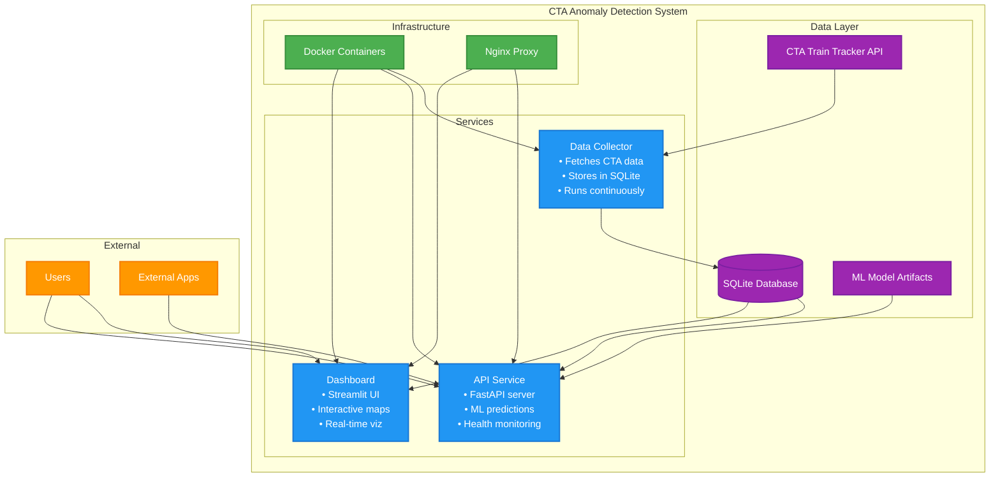

# CTA Anomaly Detection System


A real-time anomaly detection system for the Chicago Transit Authority (CTA) train network that monitors live train data, detects unusual patterns using machine learning, and provides an interactive dashboard for visualization.

## What It Does

This system continuously monitors CTA train positions and identifies anomalies in real-time, such as:
- Trains moving unusually slow or fast
- Unexpected stops between stations
- Route deviations
- System-wide disruptions

The system provides both an API for programmatic access and a web dashboard for visual monitoring.

## Quick Start

### Prerequisites
- Docker and Docker Compose installed
- Internet connection for CTA API access

### Verify Setup
```bash
./scripts/verify-setup.sh
```

### One-Command Setup
```bash
./scripts/docker-start.sh
```

This will:
- Build all Docker containers
- Start the API and dashboard services
- The API runs in safe mode (mock predictions) if no trained model is available

### Access the System
- **API**: http://localhost:8000 - REST API for predictions
- **API Docs**: http://localhost:8000/docs - Interactive API documentation
- **Dashboard**: http://localhost:8501 - Interactive map and visualizations

### Stop the System
```bash
./scripts/docker-stop.sh
```

### Manage Docker Space
Docker can use significant disk space (20+ GB is common). Monitor and clean up regularly:
```bash
# Check Docker space usage
docker system df

# Clean up unused Docker data (safe cleanup)
./scripts/docker-cleanup.sh

# For more aggressive cleanup (removes all unused data)
docker system prune -a --volumes
```

## Features

### Real-Time Monitoring
- Continuous data collection from CTA Train Tracker API
- Live anomaly detection with confidence scores
- Historical data storage and analysis

### Machine Learning
- **LightGBM**: Feature-based anomaly detection (currently deployed)
- **LSTM**: Sequence-based anomaly detection with PyTorch Lightning (optional)
- **Hardware Optimization**: Automatic detection and optimization for Apple Silicon (MPS), NVIDIA GPUs (CUDA), and CPU
- Feature engineering for temporal and spatial patterns

### Interactive Dashboard
- Real-time map visualization of train positions
- Color-coded anomaly severity indicators
- Historical trend analysis
- Model performance metrics

### Production-Ready API
- FastAPI with automatic documentation
- Containerized deployment
- Health monitoring and logging
- Scalable architecture

## Architecture



## Project Structure

```
transit_anomaly/
├── src/                             # Source code
│   ├── api/                         # FastAPI service
│   │   └── app.py                   # Main API application
│   ├── dashboard/                   # Streamlit dashboard
│   │   └── dashboard.py             # Dashboard application
│   ├── data_collection/             # CTA data fetcher
│   │   └── fetch_data.py            # Data collection script
│   └── notebooks/                   # Analysis notebooks
│       ├── 01-EDA.ipynb             # Exploratory data analysis
│       └── 02-Modeling.ipynb        # Model training
├── docker/                          # Docker configuration
│   ├── docker-compose.yml           # Main services
│   ├── docker-compose.prod.yml      # Production setup
│   ├── Dockerfile                   # API container
│   ├── Dockerfile.dashboard         # Dashboard container
│   └── Dockerfile.datacollector     # Data collector container
├── docs/                            # Documentation
├── tests/                           # Test files
├── config/                          # Configuration
│   ├── requirements.txt             # All dependencies (local dev)
│   ├── requirements-core.txt        # Core dependencies
│   ├── requirements-web.txt         # Web framework dependencies
│   ├── requirements-ml.txt          # Machine learning dependencies
│   ├── requirements-viz.txt         # Visualization dependencies
│   ├── requirements-geo.txt         # Geospatial dependencies
│   └── requirements-data.txt        # Data access dependencies
├── scripts/                         # Utility scripts
│   ├── docker-start.sh              # Start all services
│   └── docker-stop.sh               # Stop all services
├── data/                            # Data storage (SQLite database)
├── models/                          # ML model artifacts
└── geo_data/                        # Geographic data files
```

## Development

### Local Development
```bash
# Install dependencies (use consolidated file for local development)
pip install -r config/requirements.txt

# Or install in layers to match Docker approach
pip install -r config/requirements-core.txt
pip install -r config/requirements-web.txt
pip install -r config/requirements-ml.txt
# ... etc

# Run individual components
python src/data_collection/fetch_data.py
uvicorn src.api.app:app --host 0.0.0.0 --port 8000 --reload
streamlit run src/dashboard/dashboard.py
```

### Running Tests
```bash
# Test API endpoints
python tests/test_api.py

# Test Docker setup
python tests/test_docker.py

# Verify complete system setup
./scripts/verify-setup.sh
```

### Model Training
Explore the Jupyter notebooks in `src/notebooks/`:
- `01-EDA.ipynb` - Exploratory data analysis
- `02-Modeling.ipynb` - Model development and training

**Note**: If running notebooks from `src/notebooks/` directory, database paths are relative to project root (`../../data/cta_database.db`)

## Configuration

### Environment Variables
Create a `.env` file in the project root (optional):
```bash
# CTA API key (if you have one - not required for mock mode)
CTA_API_KEY=your_api_key_here

# API configuration
API_BASE_URL=http://localhost:8000
ENVIRONMENT=development

# Python path for development
PYTHONPATH=/path/to/transit_anomaly
```

### Docker Configuration
- `docker/docker-compose.yml` - Main development environment
- `docker/docker-compose.prod.yml` - Production environment with nginx
- `docker/Dockerfile` - API service container
- `docker/Dockerfile.dashboard` - Dashboard service container
- `docker/nginx.conf` - Reverse proxy configuration for production

## Model Performance

The system uses multiple anomaly detection approaches:

1. **Machine Learning**: LightGBM for feature-based detection (deployed)
2. **Deep Learning**: LSTM for sequence-based anomalies (optional, hardware-optimized)
   - **Apple Silicon**: Optimized for MPS acceleration on M1/M2/M3 Macs
   - **NVIDIA GPUs**: CUDA acceleration with mixed precision training
   - **CPU**: Lightweight fallback for any system

Performance metrics are tracked using MLflow and displayed in the dashboard.

### LSTM Training (Optional)

```bash
# Automatic hardware detection and optimization
pip install -r config/requirements-lstm-mps.txt  # For Apple Silicon
# OR
pip install -r config/requirements-lstm-cuda.txt # For NVIDIA GPUs
# OR  
pip install -r config/requirements-lstm.txt      # For CPU

# Train LSTM model (auto-detects your hardware)
python scripts/train_lstm.py

# Test LSTM implementation
python tests/test_lstm.py
```

See [LSTM Installation Guide](docs/LSTM_INSTALLATION.md) for detailed setup instructions.

## Deployment

### Production Deployment
```bash
# Start production environment
docker-compose -f docker/docker-compose.prod.yml up -d

# Scale API service
docker-compose -f docker/docker-compose.prod.yml up -d --scale api=3
```

### Cloud Deployment
The system is designed for easy deployment to:
- Google Cloud Run
- AWS App Runner
- Any Docker-compatible platform

## Documentation

- [Docker Status](docs/DOCKER_STATUS.md) - Current Docker setup status and troubleshooting
- [Docker Setup Guide](docs/DOCKER_SETUP.md) - Detailed Docker configuration
- [Project Plan](PROJECT_PLAN.md) - Original project specification and technical details

## Contributing

1. Fork the repository
2. Create a feature branch
3. Make your changes
4. Add tests for new functionality
5. Submit a pull request

## License

This project is licensed under the MIT License - see the [LICENSE](LICENSE) file for details.

## Acknowledgments

- Chicago Transit Authority for providing the Train Tracker API
- Open source community for the excellent tools and libraries used

## Troubleshooting

### Common Issues

**Database Connection Error in Notebooks**
```python
# If you get "unable to open database file" in notebooks:
# Make sure the path is relative to project root
DB_PATH = "../../data/cta_database.db"  # From src/notebooks/
```

**API KeyError: 'input_features'**
- Restart the API container: `docker-compose -f docker/docker-compose.yml restart api`
- This was fixed in recent updates

**Docker Space Issues**
- Docker can use 20+ GB of space
- Run `./scripts/docker-cleanup.sh` regularly
- Use `docker system df` to monitor usage

**Live Detection Tab Errors**
- Ensure API is running: `curl http://localhost:8000/health`
- Check API logs: `docker logs cta-anomaly-api`

## Support

For questions or issues:
1. Check the [troubleshooting section](#troubleshooting) above
2. Check the [documentation](docs/)
3. Review existing [issues](../../issues)
4. Create a new issue with detailed information

---

**Built for Chicago commuters**